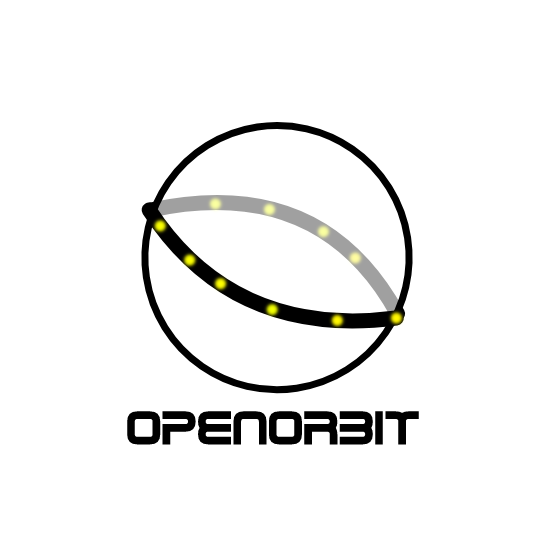

# 🚀 OpenOrbit Initiative

  
   
  <b>"Sovereignty in code, safety in orbit."</b>

## 🛰️ Overview
OpenOrbit is an independent, open-source aerospace organization dedicated to securing the future of Low Earth Orbit (LEO). We develop high-performance, autonomous satellite software designed to prevent collisions and ensure operational sovereignty for nations and private entities alike.

## 🛠️ Our Flagship: OAP (Orbital Analysis Pro)
**OAP** is a next-generation autonomous collision avoidance engine built from the ground up using **Rust**. It focuses on real-time deterministic orbital propagation and secure multi-satellite coordination.

### Key Capabilities:
* **Sovereign Swarm Protocol:** Encrypted inter-satellite negotiation using time-based rolling codes (0x-cryptography).
* **International Interoperability:** Full compliance with **CCSDS** standards for public telemetry broadcasting.
* **Precision Physics:** High-fidelity J2 perturbation models for accurate LEO propagation.
* **Extreme Efficiency:** Zero-copy architecture with critical paths optimized in **ARM64 Assembly**.

## 🧪 Technology Stack
| Layer | Tech | Purpose |
| :--- | :--- | :--- |
| **System Language** | Rust | Memory-safe & high-performance core |
| **Math Optimization** | ARM64 ASM | Low-latency emergency vector operations |
| **Standard** | CCSDS | International satellite-to-satellite communication |
| **Security** | OapCryptoCore | Private swarm identity & command verification |

## 🤝 Community & Collaboration
We believe orbital safety is a shared global responsibility. OpenOrbit welcomes contributions from aerospace engineers, physicists, and software developers worldwide.

* **Interested in contributing?** Read our `CONTRIBUTING.md` and check the issues tab.
* **Security concern?** Please refer to our `SECURITY.md` for private reporting.

---

  Developed with precision for the sustainable future of space exploration.  
  © 2026 OpenOrbit Initiative

